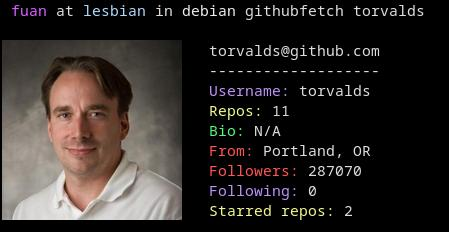
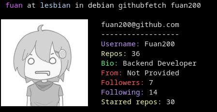

# GitHubFetch

A **Neofetch-like** CLI tool that beautifully displays GitHub profile information in your Kitty Terminal.

## Features

* GitHub user info with bio, followers, repos, etc.

## Requirements

* Rust/Cargo
* Git

## Installing

### Debian based


### Development

1. Clone the repository:

```bash
git clone git@github.com:fuan200/githubfetch.git
cd githubfetch/
```

2. Run:

```bash
cargo run -- <github-username>
```

3. Build debug and run it:

```bash
cargo build
./target/debug/githubfetch <github-username>
```

4. Build release and run it:

```bash
cargo build --release
./target/release/githubfetch <github-username>
```

### Arch Linux (AUR)
with yay:

```bash
yay -S githubfetch-fuan
```
Or manually with makepkg:

```bash
git clone https://aur.archlinux.org/githubfetch-fuan.git
cd githubfetch-fuan
makepkg -si
```
Or using the PKGBUILD from this repo:
```bash
git clone https://github.com/Fuan200/githubfetch
cd githubfetch
makepkg -si
```

### Usage
```bash
githubfetch <githubuser>
```
### Example
```bash
githubfetch torvalds
githubfetch fuan200
```

## Example output



